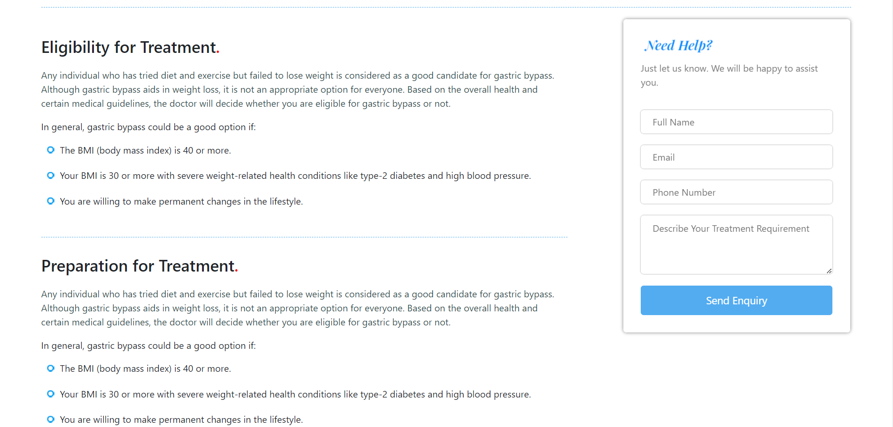

<b>Hospital-IdeaMagix</b>

Hospital-IdeaMagix is build using HTML, CSS, Bootstrap and Javascript. 

As a project received from IdeaMagix, I have developed the design of the website. I have created various HTML pages and then connected all of them together as a single web page using javascript. As per requirements I have only used HTML, CSS, Bootstrap and pure Javascript. I have designed similar website like given to me as a attachment and have also made the website fully responsive for all type of devices. I have also made use of Carousel and Accordion and designed them as per your requirements. Here are screenshots of my project-

<b>Routing</b>
/ - Login Page
/main.html - Main Website

<b>Screenshots</b>

<b>Video Link</b>
<a href="https://drive.google.com/file/d/1EehuHSgWcoUFGjZX6BcfUaicVpllGGFh/view?pli=1">https://drive.google.com/file/d/1EehuHSgWcoUFGjZX6BcfUaicVpllGGFh/view?pli=1</a>

<b>Website Link</b>
<a href="https://scarlet-worries.000webhostapp.com/">https://scarlet-worries.000webhostapp.com/</a>

<b>Github Project Link</b>
<a href="https://github.com/gayatri1904/Project-12-Hospital-IdeaMagix">https://github.com/gayatri1904/Project-12-Hospital-IdeaMagix</a>

<b>Drawback</b>
Sorry due to time issue I cannot connnect it to database using Node Js. As yesterday my grandfather got expired so I was not able to work to the project. But still I have designed the website exactly similar to the reference. Please look for my consideration.

<b>Login Credentials</b> 
<b>email</b> - gayatri@gmail.com 
<b>password</b> - gayatri123